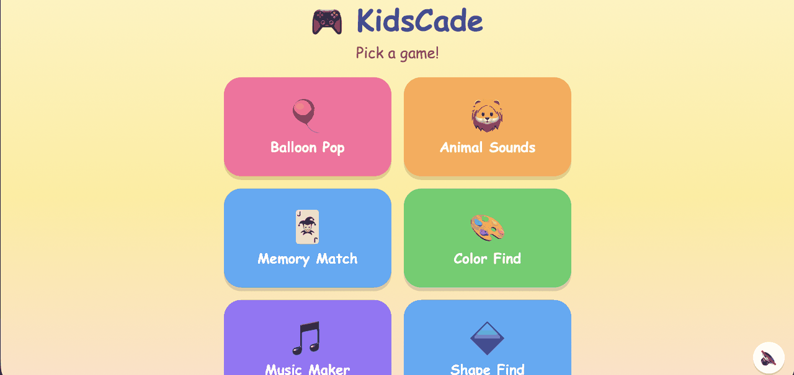
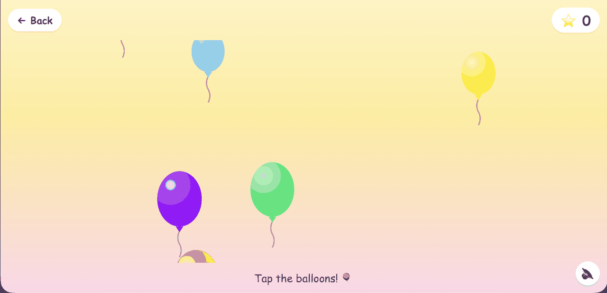
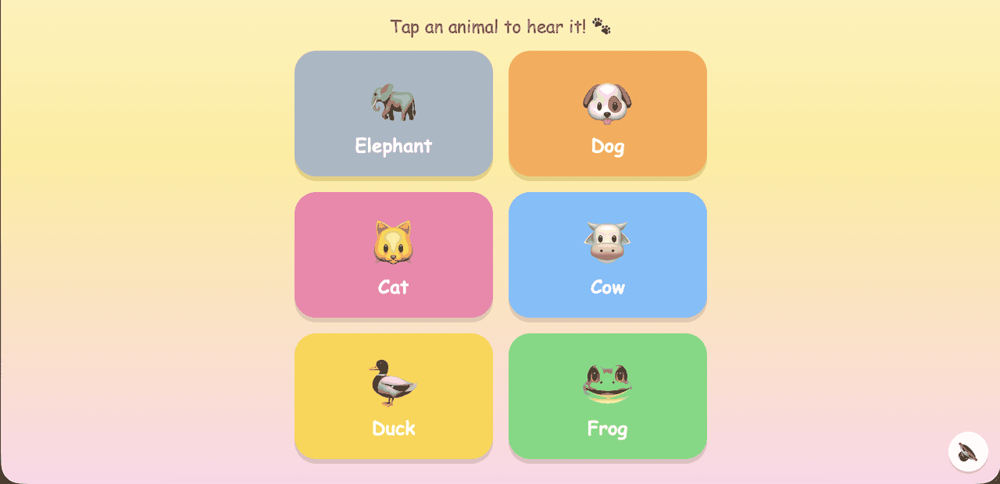
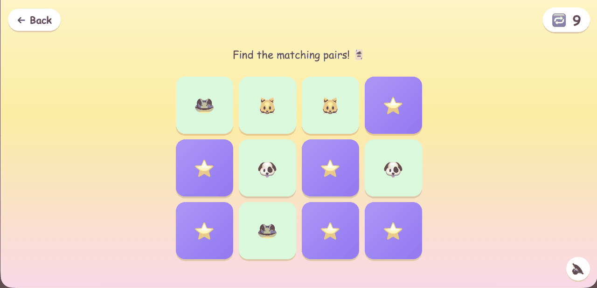
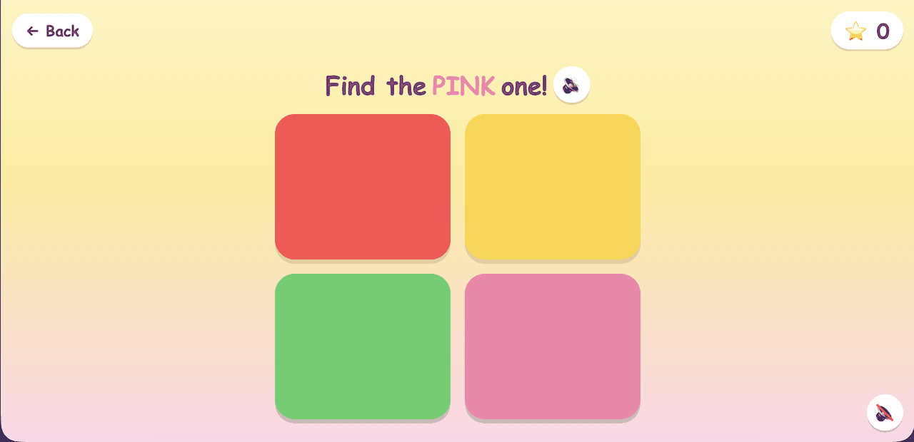
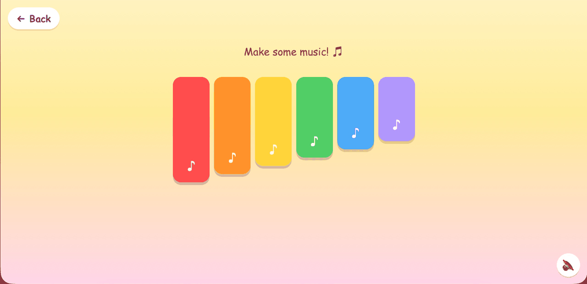
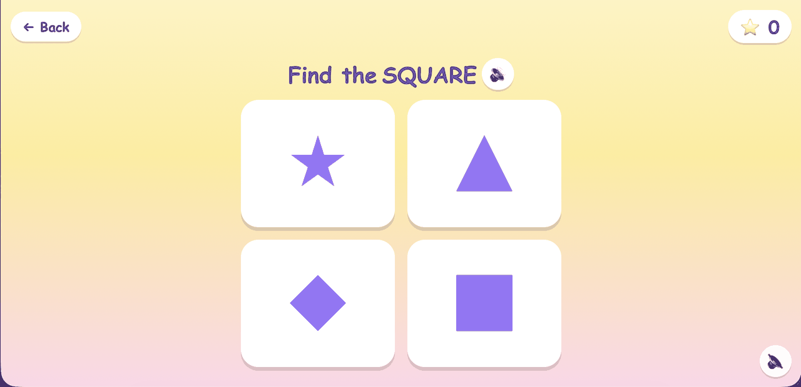
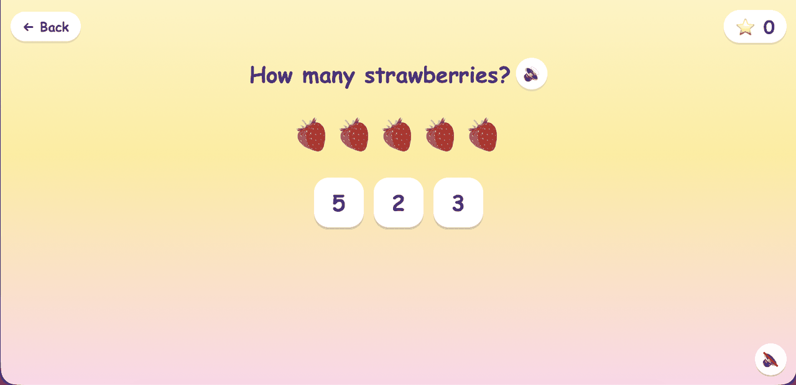

# KidsCade 🎮

A bright, cheerful arcade of mini-games for toddlers — built with React + Vite.

**Live:** https://kidscade-psi.vercel.app

## Games

- 🎈 **Balloon Pop** — tap floating balloons to pop them (synthesized pop sounds)
- 🐘 **Animal Sounds** — tap animals to hear real recordings
- 🃏 **Memory Match** — flip cards and find the pairs
- 🎨 **Color Find** — hear a color named and find it (spoken voice prompts)
- 🎵 **Music Maker** — a pentatonic xylophone that always sounds good
- 🔷 **Shape Find** — hear a shape named and find it
- 🔢 **Counting** — count the fruit, tap the right number

Plus a soft background music-box loop (with a mute button) throughout the whole arcade.

## Screenshots

| | |
|---|---|
|  |  |
|  |  |
|  |  |
|  |  |

## Tech

- React (hooks, components, props)
- Web Audio API — most sound effects and the background music are synthesized in code (Animal Sounds streams real recordings from Wikimedia Commons)
- Web Speech API — spoken prompts for Color Find, Shape Find, and Counting
- CSS animations — 3D card flips, floating balloons, bounce and shake effects
- localStorage — remembers the music on/off preference

## Run it locally

```
npm install
npm run dev
```

## License

MIT — see [LICENSE](LICENSE).
